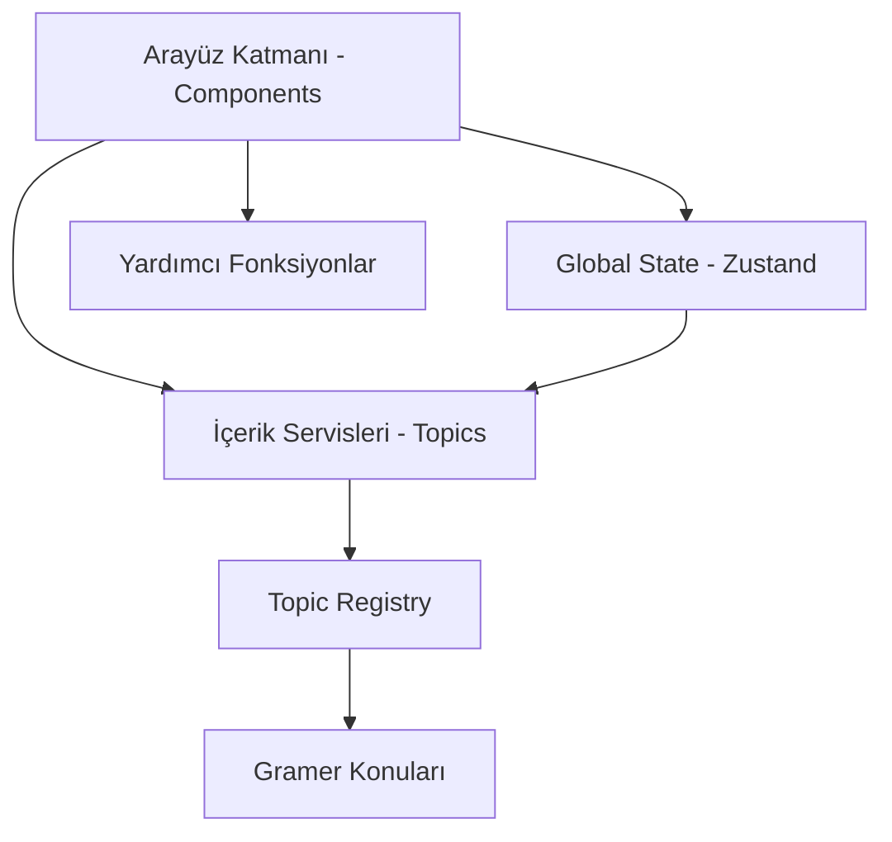

# 🏗️ Deutsch Meister — Mimari Harita (Architecture Map)

Bu döküman, projenin teknik yapısını ve bileşenler arasındaki ilişkileri özetler. Yeni agent'lar ve geliştiriciler için bir pusula görevi görür.

---

## 🛠️ Genel Mimari (Mermaid Şeması)

---

## 📂 Klasör ve Bileşen Detayları

### 1. **Global State (/store)**
- `useQuizStore.ts`: Tüm uygulamanın ana durum yönetimi. Quiz akışı, puanlama ve kullanıcı tercihlerini tutar.
- **Zorunlu Kurallar**: Global state sadece burada tutulur.

### 2. **İçerik Servisleri (/services/topics)**
- `registry.ts`: Tüm gramer konularının kaydedildiği merkezi fabrika.
- `types.ts`: Konu bazlı veri yapıları ve tipleri.
- **Konular**:
    - `possessivpronomen.ts`: İyelik zamirleri veri seti ve mantığı.
    - `prepositionen.ts`: Edatlar veri seti.

### 3. **Bileşenler (/components)**
- `StartScreen.tsx`: Giriş ekranı ve konu seçimi.
- `QuizScreen.tsx`: Soru-cevap döngüsünün gerçekleştiği ana oyun alanı.
- `ResultScreen.tsx`: Sonuç raporlama ve tekrar deneme ekranı.
- `ui/`: Button, Card gibi atomik UI bileşenleri.

### 4. **Yardımcı Araçlar (/utils)**
- `cn.ts`: Tailwind sınıf birleştirme (clsx + tailwind-merge).
- `sound.ts`: Ses efektleri (başarı/hata) yönetimi.

---

## 🚀 Yeni Agent İçin Başlangıç Protokolü

1. İlk olarak `Gemini.md` dosyasını oku.
2. `docs/ARCHITECTURE_MAP.md` dosyasını (bu dosya) incele.
3. `/services/topics/registry.ts` dosyasındaki konu kayıt sistemine bak.
4. `/store/useQuizStore.ts` içindeki state yapısını anla.

---

*Son Güncelleme: 06.04.2026 23:51:18*
